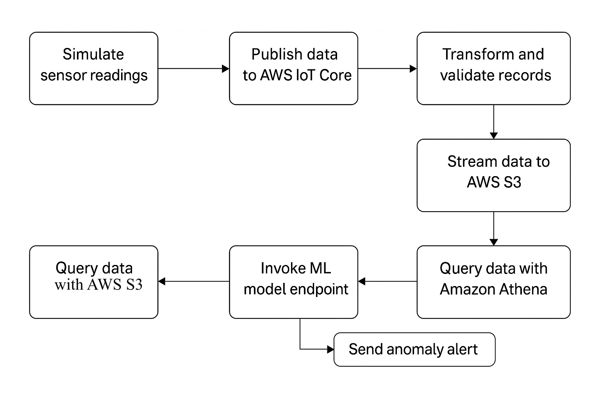

# IoT Predictive Maintenance Pipeline (AWS)

This project simulates industrial sensor data from IoT devices and streams it through an AWS-based pipeline to perform anomaly detection using a machine learning model.

## Architecture
- **AWS IoT Core** → MQTT
- **Kinesis Data Stream** → Ingest real-time events
- **Lambda Function** → Transform data + derive features
- **Firehose → S3** → Store GZIPed JSON logs
- **Glue + Athena** → Query structured data
- **SageMaker** → ML-based anomaly detection
- **SNS** → Alert via email

## Technologies
- AWS IoT Core, Kinesis, Lambda, Firehose, Glue, Athena, SageMaker, SNS
- Python (3.8), MQTT, Terraform

## Setup
1. Provision infrastructure with Terraform
2. Upload Lambda and model code
3. Simulate sensor data with `sensor_simulator.py`
4. Monitor Athena, SageMaker, and SNS alerts

## Folder Structure
[See directory structure above]

## License
MIT
